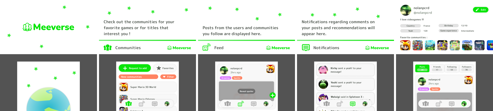

# Meeverse
An Android (and eventually iOS later) modernized clone of Miiverse.  It is designed primarily for handheld gaming devices (such as Android handheld consoles and emulation devices with two screens), while remaining fully usable on standard smartphones.

## Mockup

## Stack
- React Native for the front-end of the app
- Node.js (TS)
- PostgreSQL

## License
This project is licensed under the MIT License.

## Disclaimer
Meeverse is an independent project inspired by Miiverse.
It is not affiliated with, endorsed by, or connected to Nintendo.
All trademarks belong to their respective owners.

## Contributing
Contributions are welcome!
Please open an issue or pull request to propose changes.
By contributing, you agree that your code will be licensed under MIT.
